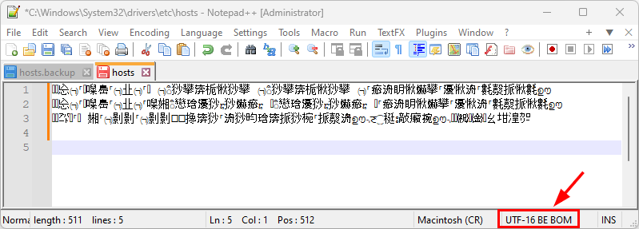

# PAM RDP Connect

**PAM RDP Connect** is used with PAM servers when connecting from a user's desktop through a PAM server to a Windows endpoint. Depending on the PAM solution used, there are different ways to handle this.  
With BeyondTrust Password Safe you download an `.rdp` file and use a local RDP client like `mstsc.exe`.  
With Senhasegura PAM you can start a local RDP client with a crafted username to direct PAM to establish a connection to the endpoint through PAM.  
With CyberArk you download an `.rdp` file and use a local RDP client to establish a connection to the endpoint through PAM.  
With Symantec PAM there are multiple RDP clients you may use. The default mechanism is to use the built-in Java Applet with the PAM Client. This is not in scope for this document. Another way is to create a TCP service which launches a local RDP client. Lastly you can use a PAM Gateway functionality, which works very similar as BeyondTrust Password Safe.

When using BeyondTrust Password Safe, Symantec PAM Gateway or CyberArk to establish an RDP session to a Windows server, an `.rdp` file is generated by the PAM server and downloaded to the user's desktop. The user uses the downloaded file to start an RDP session using `mstsc.exe`. The connection is sent to the PAM Server and the username in the `.rdp` file is mapped to a session to the real endpoint. I.e. the PAM server is the endpoint configured in the downloaded `.rdp` file. If the sessions are started as a window session and not fullscreen, you can see the filename of the `.rdp` in the Window title bar and you can identify the real endpoint by the name of the `.rdp` filename. However, if the session is started as a fullscreen session, the server name is shown in the connection bar of the remote session. The server shown in the connection bar is the hostname/IP-address of the PAM server and not of the real endpoint.


If the user only opens one connection at a time, there is little room for confusion. If, however, the user opens multiple sessions, they are all connected to the same server - the PAM server. In the fullscreen connection bar, you cannot see any difference as they are all connecting to the PAM server.

This is where **PAM RDP Connect** comes into play.

What you really want is that the endpoint hostname to be visible in the connection bar and not the hostname/address of the PAM server.


**PAM RDP Connect** is a pre-processing utility for the downloaded `.rdp` file. It will tweak the setting in the `.rdp` file, such that it seems that the connection is established to the real endpoint even though it is connecting to the PAM server. It will also launch `mstsc` using the modified `.rdp` file. From a users' point of view, the session established is to the correct endpoint.

Originally this was the single purpose of **PAM RDP Connect**.

It turned out that when using Password Safe, the downloaded `.rdp` file lacked some settings and **PAM RDP Connect** evolved to allow the user to decide on different options like font smoothing, local drive mapping and more.

To use **PAM RDP Connect**, the program must be installed on the user's desktop. It is available for installation as an installer executable. Run the installer and update the settings in the installed `pam-rdp.system.properties` and `pam-rdp.user.properties`file to match your environment.  
The program may be available through a software distribution center in your organization.

After installation there are a few tweaks necessary to be done on your desktop.

## Post installation setup

On a Windows desktop `.rdp` files are by default associated to run using the Windows Remote Desktop Connection client (e.g. `mstsc.exe`). You must change the file association for `.rdp` to the **PAM RDP Connect** program `pam-rdp.exe`.

You must make this change yourself.  
It cannot reliably be changed during installation of **PAM RDP Connect**.

Locate your Documents folder. Look for the file default.rdp. It may be a hidden file, or it may not (yet) exist. If it is not found, create a dummy file with the extension `.rdp`. The content of this file is unimportant. It can be any content. The importance is the file extension `.rdp`

Right click on any `.rdp` file and select "Properties ".


In the properties window, choose the button “Change” when opening a file of type `.rdp`.


In the list of programs, choose ”More Apps”.


A file select window will appear. Locate the file pam-rdp.exe. It is found in the folder where you installed **PAM RDP Connect**.  
The default installation path is `C:\Program Files\PAM-Exchange\PAM-RDP-Connect.`


That's it.  
When you now download an `.rdp` file from your PAM server, it will be associated to the **PAM RDP Connect** program `pam-rdp.exe`. The utility will automatically adjust the RDP settings, and you will see the correct server’s name in the RDP session's connection bar and taskbar.

## Other settings

The basic installation will correct the server’s name in the RDP session connection bar and taskbar.  
There are more settings, which you may choose to use or not to use. When **PAM RDP Connect** is installed the property file is found in the installation directory. The file `pam-rdp.user.properties` can be edited directly, and you must most likely have administrator privileges to save file. First time `pam-rdp.exe` is used or when edited using the configuration GUI utility, the property file is copied to the user's `%AppData%` directory in the path `%AppData%\PAM-Exchange\PAM-RDP-Connect`.

There is a program to configure the user's setting in the `pam-rdp.user.properties` file. When launched first time, the installed file is used as template. Users can tweak the settings and save them in their personal `%AppData%` directory.


The settings in the downloaded `.rdp` file you can tweak with **PAM RDP Connect** are:

*   Screen mode
*   Enable/disable Remote Wallpaper
*   Enable/disable Smart Window Sizing
*   Enable/disable Font Smoothing
*   Local Drive Mapping in remote session
*   Cleanup downloaded RDP files when no longer used
*   Enable/disable security prompts when connecting to a server
*   Set session color depth (bit per pixel)
*   Prompt timeout
*   Connection timeout

If these settings are defined, they will apply for all RDP sessions established using **PAM RDP Connect**.

### Screen mode

The screen mode controls how the RDP session window is started.  
The options are:

Window - Will use a fixed window size. Also specify the window width and height.

Maximize - Will use the entire desktop, but with the desktop’s taskbar still visible.

Fullscreen - Will start the RDP session in fullscreen mode.

### Remote Wallpaper

If there is no vital information in a remote session background, it is best to disable remote wallpaper in the RDP session. It will save bandwidth and the session appears to be faster and more responsive. If there is vital information on the remote server’s background, then you can enable transmitting the wallpaper in the RDP session.

### Smart Window Sizing

When a session window is resized, this setting will control if the remote desktop is scaled to match the window size. If smart sizing is disabled, a window session will use right/buttom scrollbars

  
Smart Sizing Enabled

### Font Smoothing

If this setting is set to true, text in the remote session uses font smoothing. This will require more information to be transmitted, but the text is more pleasing to read.

  
FontSmoothing Disabled

      

  
FontSmoothing Enabled

### Local Drive Mapping in remote session

This setting will control if local drives (true disks or network connected) are seen as drives on the remote server.

Typical values are:
```
C:\\;K:\\;DynamicDrives - Drives C:, K: and any drives later attached
C:\\                    - Just the C: drive
*                       - All drives
```

### Cleanup downloaded RDP files when no longer used

This setting will control if downloaded `.rdp` files are removed after they are used.

### Accept Security Prompts

When connecting to a remote server through PAM, the RDP connection from the user’s desktop is established to the PAM server. The certificate on the remote server does not match the hostname used for the connection and a security warning is shown. This setting will control if such a hostname mismatch in the certificates are silently accepted or if they are shown to the user.

### Session color depth (bit per pixel)

This setting controls how many bits per pixel are used. Permitted values are 16, 24 and 32 (bpp).

### Prompt timeout

Sometimes there are popup messages shown to the user. Typically, these will appear if there are errors in processing the downloaded `.rdp` file. Such popup messages can be acknowledged manually or the timeout will determine when it is closed automatically.

### Connection timeout

This setting controls when the connection attempt is canceled. If the session is not established within the connection timeout, the connection attempt is aborted.

## Local drives vs. Remote Network Drives

In the RDP session established, you may use local drive mapping as a mechanism to transfer files to/from the remote server. If local drive mapping is used, the local drives are available in `Network > tsclient`. When copying files to/from the mapped drive, the file copy is done through the RDP session. This is very useful for smaller files, but not for transferring large files.

  
Local Drives Mapped

If you need to copy large files to/from the remote server, it is recommended to establish a network share on the remote server and copy the files directly to that network share.

Keep in mind that the user accessing the remote server is not your regular user, but a user controlled by the PAM server. Alas, be sure that the login user (controlled by PAM) to the remote server has the necessary access permissions to the network share.

## Error handling

Errors do happen.  
Some of the errors seen so far are outlined here and a description about how to correct it.

### Failed to authenticate to one or more factors

For BeyondTrust Password Safe an error is the message when opening a session through PAM is “Failed to authenticate to one or more factors”.


This can happen for many reasons. Some of these are:

- Direct connect is used from the PAM GUI
- There are old RDP Credentials for a server on the user’s desktop
- Browser cache on the user’s desktop must be cleared

### Direct connect

Direct Connect is specific to BeyondTrust Password Safe. The icon on the far right of the PAM GUI is the "Direct connect”.

**Do not use this icon!**  
Use the lightning icon instead.

The GUI changed with version 24.2 and you can no longer select "Direct Connect" directly from the users main screen.


### Old RDP credentials

Windows will allow you to save credentials for use when connecting to a server. If credentials are saved for a particular server, these credentials will be used when the session is established. This may or may not work. It will not be the credentials managed by PAM and permissions for the user/password used may or may not work.

It is recommended to remove all Windows credentials for servers accessed through PAM.

Start Windows Credentials Manager and remove Windows Credentials for all servers (connected to through PAM).


### Browser cache

It is seen that the browser cache play tricks when opening an RDP session through PAM. Try to remove the browser cache and see if this will mitigate the error.

### Cannot connect to remote computer

When connecting to a remote server through PAM, it may sometimes appear that the Windows server is not available. This is actually the PAM server itself that is not available and not the remote server. Connection to the remote server from PAM may also fail, but this is seen differently.

The error “Remote Desktop can’t connect to the remote computer” is the session from the user’s desktop to PAM.


The error was rectified by inspecting the hosts file on the user’s desktop. The file is found in `c:\windows\system32\drivers\etc`. The content was seen as a lot of “Chinese” characters. **PAM RDP Connect** will update the hosts file as part of its operation. When the updated hosts file was written the character encoding was incorrectly set to UTF-16. **PAM RDP Connect** expects the file to be encoded using UFT-8 or ASCII.



Correcting this is done as follows:

- Stop the service “PAM-RDP-Connect Service”
- Delete the file “c:\\windows\\system32\\drivers\\etc\\hosts.backup”
- Open the hosts filen using Notepad++ or similar and save the file using ASCII or UTF-8 encoding.
- Start the service ”PAM-RDP-Connect Service”
